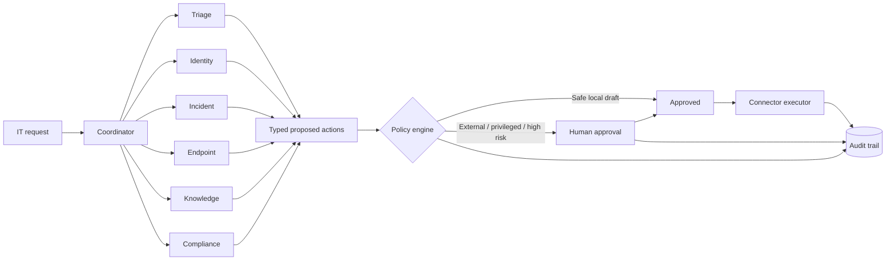

<p align="center">
  
</p>

<div align="center">

# IT Agent Platform

### Approval-first automation for modern IT operations

Coordinate specialized agents, enforce human authorization, and preserve a complete audit trail
before any operational action reaches an external system.

[](https://github.com/PlainJane20/it-agent-platform/actions/workflows/ci.yml)
[](https://www.python.org/)
[](https://fastapi.tiangolo.com/)
[](LICENSE)
[](#production-readiness)

</div>

---

<div align="center">

| 6 specialist agents | 2 analysis modes | 4 protected action classes | 93% test coverage |
|:---:|:---:|:---:|:---:|
| Triage → Compliance | Deterministic + OpenAI | External · Privileged · Destructive · High-risk | Policy · API · Audit · Model boundary |

</div>

## Overview

IT Agent Platform is a security-conscious reference implementation for automating repeatable IT
workflows. A coordinator routes each request to focused specialist agents. Those agents analyze
the request and propose typed actions, while a deterministic policy engine decides which actions
require human approval.

The project runs safely without external credentials. Its default mock executor records what
*would* happen without changing a ticket, identity, endpoint, or production system.

### Why this project

Operational automation needs more than a capable model. It also needs clear authority boundaries,
predictable action schemas, least-privilege integrations, idempotency, and evidence that explains
who approved what. This repository demonstrates those controls as working application code.

> **Why I built it:** this is a personal project, built to get real practice designing the
> authority boundary in an automation system — the line between what a model is allowed to
> propose and what is actually allowed to touch a ticket, an identity, or an endpoint. The
> deterministic policy engine, the typed action taxonomy, the per-agent operation allowlist, and
> the idempotency keys all exist for the same reason: "the model recommended it" and "the system
> did it" have to stay two separately auditable steps, not one step described twice. That's the
> competency a Staff/Principal IT-org TPM role actually tests for — not whether automation works
> on the happy path, but whether you can point to the specific control that stops a model from
> approving its own privileged or destructive action, and produce the audit trail that proves it.
> The mock executor and offline deterministic mode are deliberate — this was practice on the
> control design itself, before wiring it to anything with real blast radius.

## IT workflows this platform can grow into

<table>
  <tr>
    <td width="33%" valign="top">
      <h3>🎫 Service operations</h3>
      Classify, enrich, prioritize, and route service requests before a reviewed write-back.
    </td>
    <td width="33%" valign="top">
      <h3>🔐 Identity lifecycle</h3>
      Prepare joiner, mover, leaver, access-review, and account-remediation actions.
    </td>
    <td width="33%" valign="top">
      <h3>🚨 Incident response</h3>
      Assemble evidence, draft timelines, and propose controlled containment steps.
    </td>
  </tr>
  <tr>
    <td width="33%" valign="top">
      <h3>💻 Endpoint health</h3>
      Review device posture, patch compliance, and maintenance-window remediation.
    </td>
    <td width="33%" valign="top">
      <h3>📚 Knowledge capture</h3>
      Convert resolved work into reusable runbooks and support documentation.
    </td>
    <td width="33%" valign="top">
      <h3>✅ Control evidence</h3>
      Prepare evidence checklists and surface compliance implications for review.
    </td>
  </tr>
</table>

## Key capabilities

| Capability | Implementation |
|---|---|
| Multi-agent coordination | Deterministic routing with concurrent specialist analysis |
| Analysis modes | Offline deterministic mode or OpenAI structured-output mode |
| Human oversight | Mandatory approval for external, privileged, destructive, and high-risk work |
| Action safety | Typed actions, per-agent operation allowlists, and idempotency keys |
| Auditability | Workflow, policy, approval, and execution events stored in SQLite |
| Integration boundary | Connector interface with a no-side-effect mock executor by default |
| Developer experience | FastAPI, interactive OpenAPI docs, Docker, Ruff, pytest, and GitHub Actions |

## System architecture



The model layer can recommend actions, but it cannot modify the policy engine, approve its own
work, add connector operations, or execute against an external system.

## Specialist agents

| Agent | Responsibility | Example output |
|---|---|---|
| **Triage** | Classify, prioritize, enrich, and route requests | Ticket update proposal |
| **Identity** | Review access, onboarding, offboarding, and account lifecycle | Access review or disable proposal |
| **Incident** | Assemble evidence and incident timelines | Incident timeline draft |
| **Endpoint** | Review device compliance, patching, and remediation | Remediation schedule proposal |
| **Knowledge** | Convert resolutions into reusable guidance | Knowledge article draft |
| **Compliance** | Identify evidence and control implications | Control evidence checklist |

## Quick start

### Requirements

- Python 3.9 or newer
- Git
- An OpenAI API key only if using OpenAI analysis mode

### Install and run

```bash
git clone https://github.com/PlainJane20/it-agent-platform.git
cd it-agent-platform

python3 -m venv .venv
source .venv/bin/activate
pip install -e '.[dev]'
cp .env.example .env

pytest
uvicorn it_agent_platform.api:app --reload
```

Open the interactive API at [http://127.0.0.1:8000/docs](http://127.0.0.1:8000/docs).

Alternatively, use the included developer commands:

```bash
make install
make check
make run
```

## Try the approval workflow

Submit the included service request:

```bash
curl -s http://127.0.0.1:8000/v1/workflows \
  -H 'Content-Type: application/json' \
  --data @examples/service_request.json
```

The response contains one or more proposed actions. An external ticket write is returned with
`approval_required`; it does not execute automatically.

Approve a reviewed action:

```bash
curl -s -X POST http://127.0.0.1:8000/v1/actions/ACTION_ID/approve \
  -H 'Content-Type: application/json' \
  -H 'X-Actor: lead@example.com' \
  -d '{"approver":"lead@example.com","reason":"Reviewed and authorized"}'
```

Execute the approved action:

```bash
curl -s -X POST http://127.0.0.1:8000/v1/actions/ACTION_ID/execute \
  -H 'X-Actor: lead@example.com'
```

The default response contains `"mode": "mock"`, confirming that no external change occurred.

## API surface

| Method | Endpoint | Purpose |
|---|---|---|
| `GET` | `/health` | Service health check |
| `POST` | `/v1/workflows` | Submit and analyze an IT request |
| `POST` | `/v1/actions/{action_id}/approve` | Record a human approval decision |
| `POST` | `/v1/actions/{action_id}/execute` | Execute an approved action through the configured connector |
| `GET` | `/v1/workflows/{workflow_id}/audit` | Retrieve the workflow audit trail |

## Configuration

| Variable | Default | Description |
|---|---|---|
| `IT_AGENT_ANALYSIS_MODE` | `deterministic` | Selects `deterministic` or `openai` specialist analysis |
| `IT_AGENT_EXECUTION_MODE` | `mock` | Reserved execution mode; the included executor remains mock-only |
| `IT_AGENT_DB_PATH` | `./it_agent_platform.db` | SQLite audit database location |
| `OPENAI_MODEL` | `gpt-5.6-terra` | Model used by OpenAI-backed specialists |
| `OPENAI_API_KEY` | unset | Required only when analysis mode is `openai` |

Never commit `.env` or provider credentials. Use a managed secret store in deployed environments.

## OpenAI analysis mode

Set the following values in `.env`:

```env
OPENAI_API_KEY=your-key
OPENAI_MODEL=gpt-5.6-terra
IT_AGENT_ANALYSIS_MODE=openai
IT_AGENT_EXECUTION_MODE=mock
```

The coordinator invokes selected specialists concurrently, and each response is parsed against a
strict Pydantic schema. Application code then filters every proposal through that agent's allowed
operations and the central approval policy.

## Project structure

```text
src/it_agent_platform/
├── agents/              # Coordinator, deterministic specialists, OpenAI adapter
├── integrations/        # Executor contract and safe mock implementation
├── api.py               # FastAPI routes and development authentication boundary
├── audit.py             # SQLite event trail
├── config.py            # Environment-based settings
├── models.py            # Typed workflow, evidence, action, and approval models
├── policy.py            # Deterministic approval rules
└── service.py           # Application orchestration layer

tests/                   # Policy, workflow, API, and model-boundary tests
docs/                    # Architecture, operations, and threat-model documentation
examples/                # Ready-to-submit example payloads
```

## Testing

```bash
make check
```

The test suite covers routing, policy decisions, unauthorized execution, the approval lifecycle,
HTTP behavior, audit events, mock execution, and enforcement of model operation allowlists.

## Production readiness

This repository is a **reference implementation**, not a turnkey production control plane.
Before connecting a real IT system:

1. Replace `X-Actor` development headers with verified SSO/JWT identity.
2. Move audit events to an append-only centralized store with retention controls.
3. Encrypt sensitive fields and complete a privacy/data-classification review.
4. Implement one least-privilege connector against a non-production tenant.
5. Add connector-side target validation, authorization, and idempotent retries.
6. Build an evaluation set from representative, sanitized requests.
7. Exercise rollback, outage, rate-limit, and partial-failure procedures.

See [Operations](docs/OPERATIONS.md), [Architecture](docs/ARCHITECTURE.md), and the
[Threat Model](docs/THREAT_MODEL.md) for the detailed controls.

## Roadmap

- [ ] Durable workflow and action state
- [ ] SSO/JWT authentication and role-based authorization
- [ ] ServiceNow or Jira Service Management sandbox connector
- [ ] Microsoft Entra ID or Okta sandbox connector
- [ ] Metrics, traces, and operational dashboards
- [ ] Evaluation dataset and quality gates
- [ ] Deployment templates for a managed container platform

## Contributing

Contributions and design discussions are welcome. Review [CONTRIBUTING.md](CONTRIBUTING.md) before
opening a pull request. For security concerns, follow [SECURITY.md](SECURITY.md) instead of filing
a public issue.

> **Related work in this portfolio:** [agent-control-tower](https://github.com/PlainJane20/agent-control-tower)
> is the closest genuine overlap — both separate a model's proposal from an approval decision from
> execution, behind an append-only audit trail. The difference is real, not cosmetic:
> agent-control-tower is a generic governance wrapper retrofitted onto two already-running agents
> (slack-daily-agent, exec-status-rollup) after the fact, while this repo builds that
> propose/approve/execute boundary in from the start around one domain, with a typed action
> taxonomy and per-agent operation allowlists specific to IT operations. Same underlying interest
> in authority boundaries for automation, approached from opposite directions — retrofit versus
> ground-up.

---

## Contact

<div align="center">

### Navi Sohi

*Technical Program Manager & Automation Engineer*

<a href="https://www.linkedin.com/in/navisohi/"></a>
<a href="https://github.com/PlainJane20"></a>
<a href="mailto:nks.ai.dev@gmail.com"></a>

</div>

## License

Copyright © 2026 Navi Sohi.

This project is distributed under the [MIT License](LICENSE). Reuse is permitted under the
license terms, provided the copyright and license notice are retained in copies or substantial
portions of the software.
