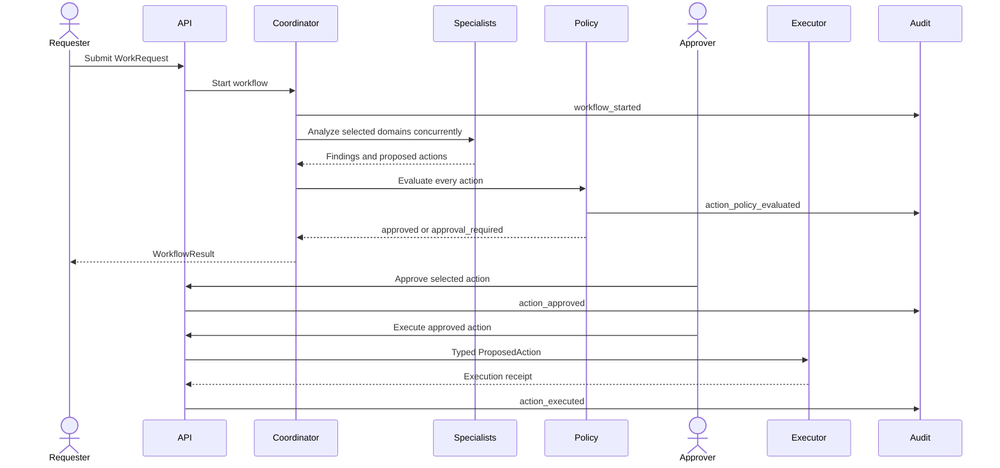
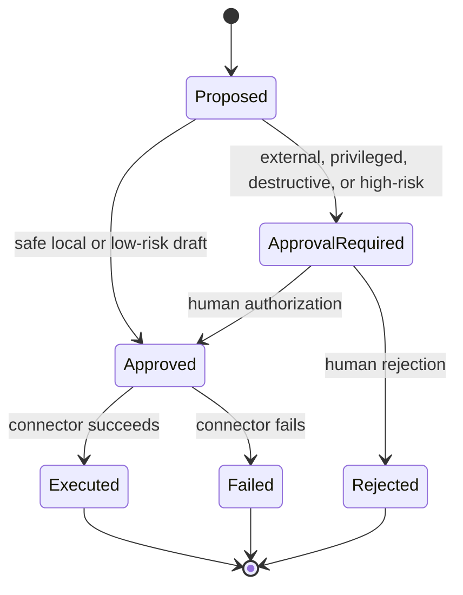

# Architecture

## Design goals

IT Agent Platform separates probabilistic analysis from deterministic authorization. The design
optimizes for explainability, constrained execution, safe local evaluation, and incremental
adoption of external IT connectors.

The current version is intentionally a modular monolith. It keeps the security boundaries visible
without introducing distributed-system complexity before durable state and real integrations are
required.

## Request lifecycle

## Components

| Component | Responsibility | Trust level |
|---|---|---|
| FastAPI boundary | Validate input, expose workflow endpoints, carry development actor identity | Untrusted input boundary |
| Coordinator | Route requests, run specialists concurrently, aggregate findings | Advisory orchestration |
| Specialist agents | Analyze a narrow domain and propose typed actions | Untrusted/advisory output |
| OpenAI adapter | Parse model output into strict schemas and enforce operation allowlists | Advisory output boundary |
| Approval policy | Classify which actions require authorization | Deterministic control plane |
| Automation service | Enforce action lifecycle and call the executor | Trusted application layer |
| Action executor | Translate approved actions into provider operations | High-trust integration boundary |
| Audit log | Record workflow, policy, approval, and execution evidence | Accountability boundary |

## Routing and specialist execution

The coordinator always includes triage and adds domain specialists when the request matches their
scope. Independent specialists run with `asyncio.gather`, reducing latency while preserving one
result per domain.

Two analysis implementations share the same `SpecialistAgent` contract:

- **Deterministic specialists** provide an offline, reproducible baseline for tests and demos.
- **OpenAI specialists** request strict structured output and convert only allowed operations into
  application actions.

Routing determines who may analyze a request; it does not grant permission to execute.

## Action lifecycle

Every action includes its originating workflow, specialist, operation, target, arguments,
rationale, risk, status, and idempotency key. The model cannot set an action to `approved` or
`executed`; the application owns those transitions.

## Security invariants

1. Model output is advisory and never overrides the policy engine.
2. A specialist may emit only operations in its application-defined allowlist.
3. External, privileged, destructive, and high-risk work requires approval.
4. Execution accepts only actions in the `approved` state.
5. Every approval and execution identifies an actor and creates an audit event.
6. The repository defaults to a mock executor with no external effects.
7. Provider credentials never belong in prompts, request metadata, or audit payloads.

## Persistence

SQLite currently stores audit events. The in-memory action registry holds pending actions and is
lost when the process restarts. That division is acceptable for a reference implementation but
not for production. A durable implementation should persist workflow and action state in a
transactional database and place audit events in an append-only store.

## Connector contract

Production adapters implement `ActionExecutor.execute`. Each adapter must:

- Accept only explicitly supported operations.
- Revalidate target and actor authorization at execution time.
- Use the supplied idempotency key for duplicate suppression.
- Apply bounded timeouts and retries only to safe retryable failures.
- Return a provider request ID and normalized outcome.
- Redact credentials and unnecessary personal data from errors and logs.
- Support contract testing in a non-production tenant.

## Extension points

| Extension | Primary files | Required validation |
|---|---|---|
| New specialist | `agents/`, coordinator routing | Scope, routing, schema, and allowlist tests |
| New action kind | `models.py`, `policy.py` | Explicit policy and lifecycle tests |
| New connector | `integrations/` | Authorization, idempotency, failure, and sandbox contract tests |
| Durable state | `service.py`, persistence adapter | Concurrency, recovery, and migration tests |
| Production identity | `api.py`, authorization layer | Token validation, RBAC, expiry, and impersonation tests |
